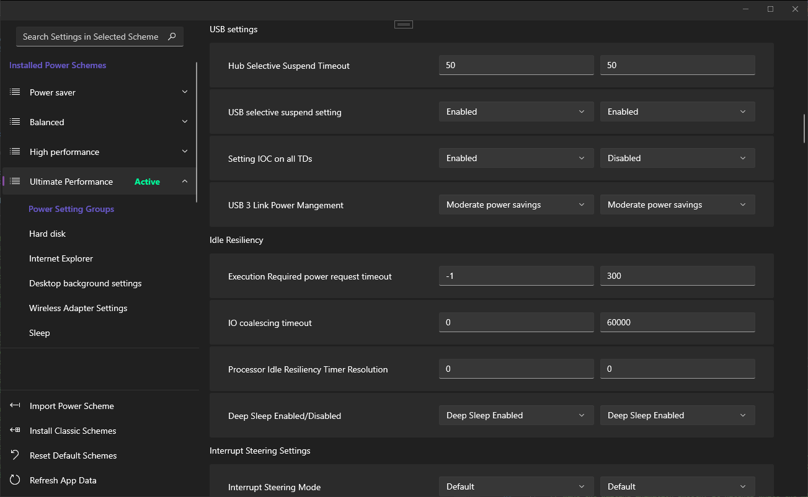

# Better Power

A barebones WINUI3 application, with the bare minimum of code and UI functionality, to provide a modern way to sort and change the power settings on a Windows 10 machine.

Microsoft has hid, fragmented, and obfuscated core system settings and functions. The settings that are accessible through the modern menu are spread over multiple pages, with terrible UI design, nonintuitive layout, and a frustrating nonfunctional search. Often, the modern setting app will contain links to multiple legacy settings windows carried over from Windows Vista, XP, and 1995.

This project is the beginnings of a drop-in fix for the shameful state of Windows settings - firstly, to unhide every setting that is present; secondly, to provide basic functions like search and navigation that actually works, in one unified place (like every other OS with a gui attached to it since 2001).

I thought I'd attempt to take on power settings by themselves at first, and expand to other settings as time allows. As of today, my above-stated goals are not necessarily achieved - and the code itself is as anemic as possible to produce a running UI. On the other hand, it is already significantly better than the built-in "change advanced power settings" window - which can't be resized! - if you can get it to build and run in its current state.

Some features are held back by the beta-ish nature of WINUI3. However, most of these things just need time to research, design, and implement. As a first foray into a strongly OOP UI, this has been a strange and interesting project. A note - I pretty much directly cloned the UI design from PowerToys [https://github.com/microsoft/PowerToys].

## What is present in this application:

viewing all power settings in each installed system power scheme
viewing the power settings in a given setting group, under a given scheme
fast search against setting names
scheme operations: set active, rename, copy, delete, export to file, import from file
install classic schemes (power saver, balanced, high perf, ultimate performance)
reset installed system schemes to default schemes
animations and notifications to indicate an operation has succeeded or failed
refreshing application data to reflect system changes
hotkeys to support rename, copy, delete, refresh

## What is missing from this codebase:

unit testing
integration testing
UI testing
compatibility testing / windows versioning awareness
performant and stable system APIs (right now it uses powershell, and parses strings from its output)
awareness of system state-changes
"correct" use of Windows application styles / theme awareness
packaging

## What is missing from this application:

editable "favorites" and "frequently used" pages
reorderable pages in main nav
UI indication of which settings are for "Plugged In" mode vs. "On Battery"
ability to reset a scheme's settings to its default scheme settings
coherent resizing of settings cards
initial window sizing
units and range checking for settings
